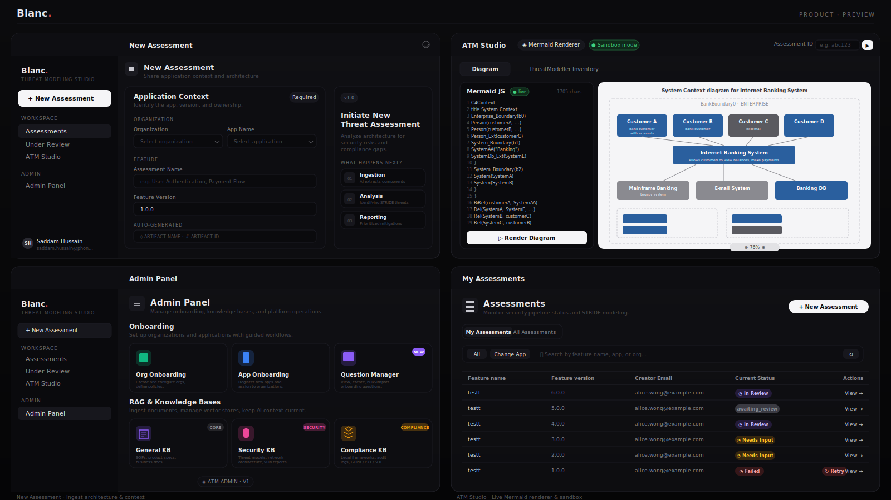

<div align="center">

### AI powered Threat Modeling Studio that identifies threats in your design artifacts, the output of which can be directly passed to your coding agent's prompt during development.

<em>Blanc takes architecture diagrams, sequence diagrams and design documents as inputs and identifies threats. </em>

<br/>

[](LICENSE)
[](https://github.com/blanc-project/blanc/stargazers)


<br/>

[](https://discord.gg/)
&nbsp;
[](atm_service/CODEBASE_DOCUMENTATION.md)

<br/>

**[Quick Start](#quick-start)** · **[Why Blanc](#why-blanc)** · **[Framework Coverage](#framework-coverage)** · **[How It Works](#how-blanc-works)** · **[Docs](atm_service/CODEBASE_DOCUMENTATION.md)**

<br/>

</div>

**Blanc.** is an open-source threat modeling studio that helps security and engineering teams identify threats directly from design-level engineering artifacts.

*By parsing architecture diagrams, sequence diagrams, data flow diagrams, and supporting design documents, Blanc. analyzes system interactions, trust boundaries, and data movement to surface potential security threats early in the development lifecycle.*

Blanc. aims to shift threat modeling from a manual workshop-driven activity into a scalable, repeatable, and developer-friendly workflow.

### Key Capabilities

- Identify threats, given a design artifact (architecture diagram, sequence diagram or business document)
- Generate reports in md-format that can be consumed directly by coding agents
- Add custom prompts for threat detection
- Create a new architecture diagram or sequence diagram via Blanc. Studio
- Comments and interactions on identified threats
- Generate reports in pdf format for audit and compliance needs
- Add custom rags and connectors based on what your organization uses
- Works with free models with open-ai support



## Why Blanc.?

While threat modeling sounds straightforward in theory, applying it in practice is often difficult.

Teams frequently struggle to determine the right level of depth - where to stop, which risks matter, and what should be ignored.

As a result, threat modeling sessions often become one of two extremes:

* Identifying too many hypothetical threats and creating unnecessary complexity
* Repeating the same generic threats across every feature without meaningful context

Effective threat modeling is not about finding every possible threat - it is about identifying the most relevant risks for the design being reviewed.

Blanc. is designed to make threat modeling **collaborative** - enabling Product, Business, Architecture, Engineering, Compliance, Privacy, and Security teams to work together through shared artifacts, structured questions, and contextual threats.

With Blanc., teams can:

* Start from design-level artifacts such as architecture diagrams, sequence diagrams, PRDs, and BRDs
* Ask structured questions that capture the security context of each component and data flow
* Identify threats that are relevant to the specific design, rather than repeating generic checklists
* Track assessments across applications, features, and feature versions
* Collaborate on assumptions, mitigations, and design changes throughout the development lifecycle
* Maintain organization-wide visibility into threat modeling progress and outstanding work

Blanc. is not designed to replace security expertise with automated threat lists.

It is designed to help teams apply security expertise earlier, consistently, and collaboratively—so that threat modeling becomes a continuous design practice rather than a one-time compliance activity.


## How Blanc Works

At a high level, Blanc follows this analysis flow:


1. Ingest one or more architecture diagrams (and optional supporting PDFs) into an assessment record and queue them for analysis.
2. For each image, run a 6-stage LLM pipeline that produces a Mermaid data-flow diagram, an analysis summary, a component inventory, and framework-agnostic clarification questions.
3. Auto-answer clarification questions from the RAG knowledge base where possible; surface the remainder to the user (assessment sits in `NEEDS_INPUT`).
4. Feed merged image data + answers into per-framework threat generators (STRIDE / BUSINESS_LOGIC) and persist each threat with full provenance.
5. Assign reviewers, capture per-threat approve / reject / comment decisions, and drive the assessment to `APPROVED` or `CHANGES_REQUESTED`.
6. Log every LLM call with token counts and cost, so spend per assessment is fully auditable.

## Quick Start

Blanc has two components — a FastAPI backend (`atm_service/`) and a Next.js studio (`atm/`). You'll need Python 3.12, Node.js 20+, MariaDB 10.6+, RabbitMQ 3.11+, and an OpenAI-compatible LLM endpoint.

### Run via Docker

You can build docker images for both services from the repository.

```bash
git clone https://github.com/blanc-project/blanc.git
cd blanc

# Backend
docker build -t blanc-service ./atm_service
docker run -p 8000:8000 --env ENV=local blanc-service

# Studio
docker build -t blanc-studio ./atm
docker run -p 3000:80 blanc-studio
```

> The studio talks to the backend at `http://localhost:8000` by default. Update the API base URL in [atm/lib/api-client.ts](atm/lib/api-client.ts) if you're running the services on different hosts.

### Run locally

```bash
git clone https://github.com/blanc-project/blanc.git
cd blanc

# Backend
cd atm_service
python3.12 -m venv env
source env/bin/activate
pip install -r requirements.txt
ENV=local python3 main.py

# Studio (in a second terminal)
cd ../atm
npm install
npm run dev
```

The API comes up on `http://localhost:8000` (with `/uploads` serving uploaded artifacts) and the studio on `http://localhost:3000`.