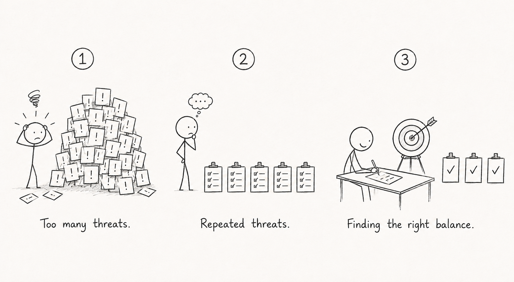
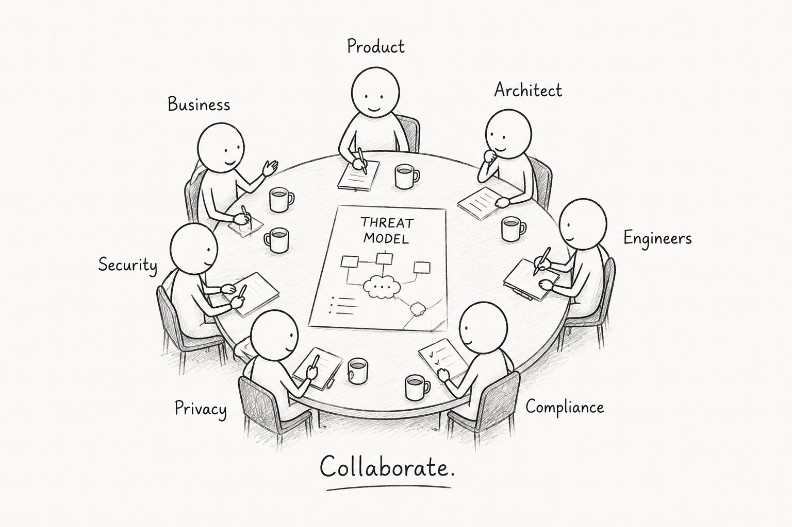
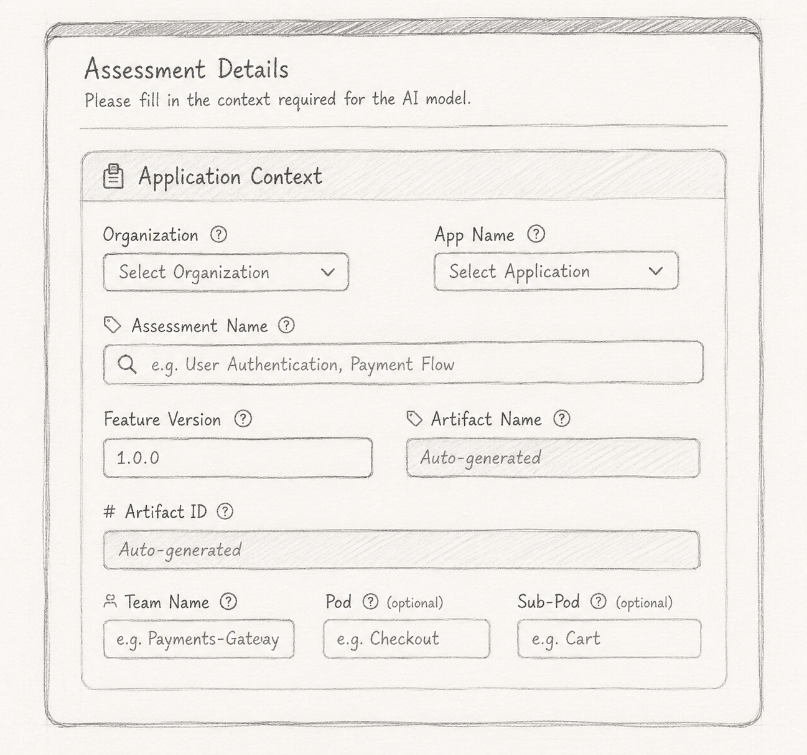

## What is Threat Modeling?

According to Microsoft:

> “It’s an engineering technique you can use to help you identify threats, attacks, vulnerabilities, and countermeasures that could affect your application. You can use threat modeling to shape your application's design, meet your company's security objectives, and reduce risk.”

According to OWASP:

> “Threat modeling is a structured activity for identifying, evaluating, and managing system threats, architectural design flaws, and recommended security mitigations. It is typically done as part of the design phase or as part of a security assessment.”

To keep it simple:

*Threat modeling is the practice of understanding a system, identifying what could go wrong, and improving the design before it is built.*

## Why has Threat Modeling not been widely adopted?

  

While threat modeling sounds straightforward in theory, applying it in practice is often difficult.

Teams frequently struggle to determine the right level of depth - where to stop, which risks matter, and what should be ignored.

As a result, threat modeling sessions often become one of two extremes:

* Identifying too many hypothetical threats and creating unnecessary complexity
* Repeating the same generic threats across every feature without meaningful context

Effective threat modeling is not about finding every possible threat - it is about identifying the most relevant risks for the design being reviewed.

## How do we make Threat Modeling sustainable?

Make it ***collaborative.***

Threat modeling should not be an activity owned only by Security Engineers. Product teams, Architects, Developers, Compliance, and Privacy teams all contribute different perspectives to understanding risk.

Threat modeling should become a continuous learning process - where teams refine assumptions, improve designs, and build shared security understanding over time.

  

## Design Principles

Many automated threat modeling tools exist today and have evolved over time, but most are optimized for security-led workflows.

Blanc. is designed to make threat modeling **collaborative** - enabling Product, Business, Architecture, Engineering, Compliance, Privacy, and Security teams to work together through shared artifacts, structured questions, and contextual threats.

*The goal is not only to identify threats, but to continuously improve security understanding across teams.*

## Structured by Design

Blanc. provides a structured workflow and a unified view of threat modeling across the organization.

* Onboard applications
* Organize and model features
* Track enhancements through feature versions
* Define workflows across multiple artifacts
* View organization-wide threat modeling progress and status

  

