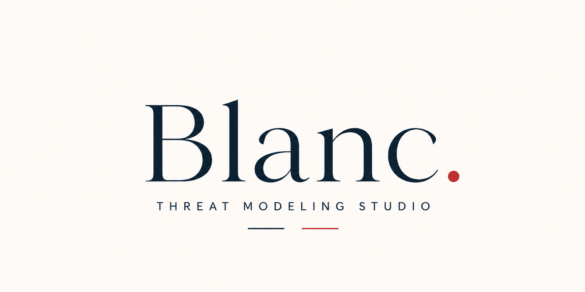
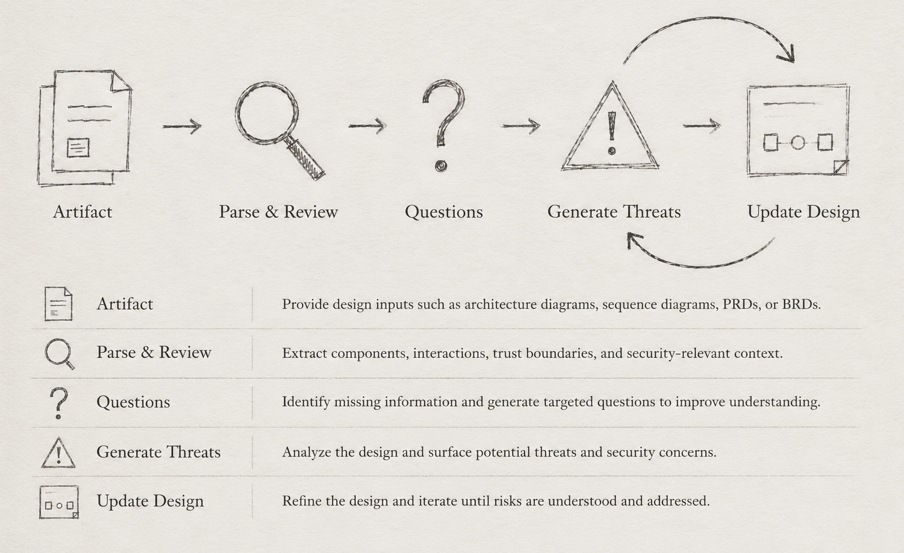

  

**Blanc.** is an open-source threat modeling studio that helps security and engineering teams identify threats directly from design-level engineering artifacts.

*By parsing architecture diagrams, sequence diagrams, data flow diagrams, and supporting design documents, Blanc. analyzes system interactions, trust boundaries, and data movement to surface potential security threats early in the development lifecycle.*

Blanc. aims to shift threat modeling from a manual workshop-driven activity into a scalable, repeatable, and developer-friendly workflow.

## Who is this for?

**Product Security Teams** performing design reviews and identifying threats before implementation.

**Software Architects & Developers** validating security assumptions, making secure design decisions early, and identifying threats while creating Product Requirement Documents (PRDs) and system designs.

**Product & Business Teams** evaluating security implications while creating Business Requirement Documents (BRDs) and defining product workflows.

**Compliance & Privacy Teams** reviewing architecture decisions against regulatory, governance, and privacy requirements.

### Workflow

  

## Supported Artifacts

**Architecture Diagrams**
Model services, trust boundaries, data movement, and system interactions.

**Sequence Diagrams**
Understand request flows, actors, and execution paths across systems.

**Product Requirement Documents (PRDs)**
Identify security assumptions and design considerations during product definition.

**Business Requirement Documents (BRDs)**
Evaluate business workflows, data sensitivity, compliance, and risk early.

## Supported Frameworks

| Framework      | Status   | Description                                                                                                                            |
| -------------- | -------- | -------------------------------------------------------------------------------------------------------------------------------------- |
| STRIDE         | ✓        | Identifies threats across Spoofing, Tampering, Repudiation, Information Disclosure, Denial of Service, and Elevation of Privilege.     |
| BUSINESS_LOGIC | ✓        | OWASP-inspired categories: lifecycle & orphaned transitions, sequential state bypass, missing role / permission checks, replays of idempotent operations, race conditions, and resource-quota abuse. |
| PASTA          | Planned  | Risk-centric methodology that analyses applications across seven stages from business context to attack scenarios. On the roadmap.     |
| CIA            | X        | Confidentiality / Integrity / Availability model. Not planned as a first-class generator.                                              |
