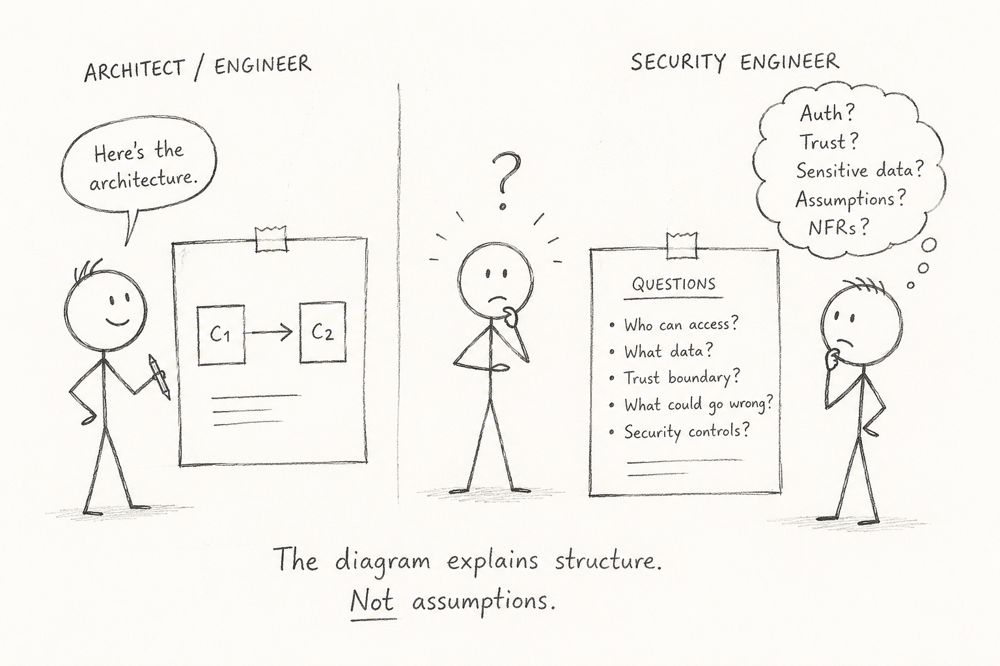
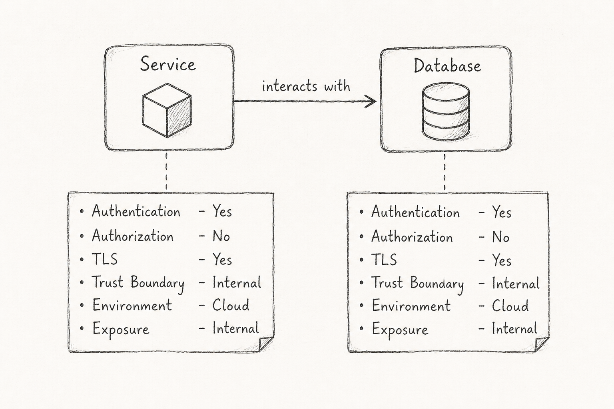
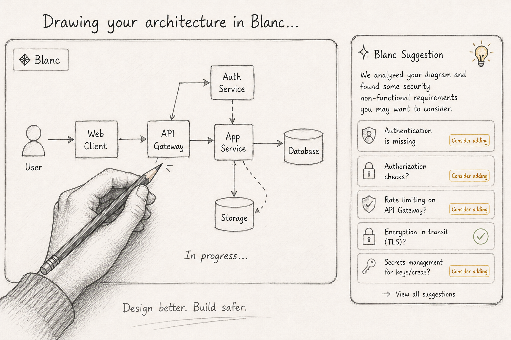

## Process of Threat Modeling

  

In practice, threat modeling is often less ambiguous than it appears in theory.

One of the biggest challenges is that the quality and structure of threat modeling depends heavily on the artifacts being reviewed.

Architects and Engineers may model systems differently, while Security Engineers may interpret those artifacts differently during review.

For example:

* Architecture diagrams often mix system structure with execution flows
* Sequence diagrams may omit assumptions and trust boundaries
* Different teams may combine multiple modeling approaches instead of following a consistent structure (for example C4-style diagrams)

Another challenge is that security concerns are often implicit rather than explicit.

For example, a diagram may show that Component A communicates with Component B, but it may not describe:

* Authentication and authorization expectations
* Trust boundaries
* Data sensitivity
* Security assumptions
* Non-functional requirements (NFRs)

As a result, effective threat modeling is not only about reviewing artifacts - it is also about improving how systems are described.

## How are we solving this with Blanc?

Blanc. bridges the gap between Engineering and Security by acting as a collaborative design workspace that helps make implicit security assumptions explicit.

Given a design artifact, Blanc. extracts components and interactions and guides users by surfacing security considerations that are often missing from design discussions.

For each component and interaction, Blanc. helps teams reason about:

* Authentication
* Authorization
* Transport Security (TLS)
* Trust Boundaries (external vs internal, network segmentation, service boundaries)
* Environment (Cloud / Data Center, compute platforms, runtime environments, logical tiers)
* Exposure (public, partner, internal)

  

## Making it Easier with Blanc.

We also took it a step further.

Using **Blanc**, you can directly create these diagrams and Blanc will automatically understand the described components, identify interactions, and suggest missing **security non-functional requirements (NFRs)**.

This helps teams move from architecture design → security review → threat identification without manually modeling every component.

  

